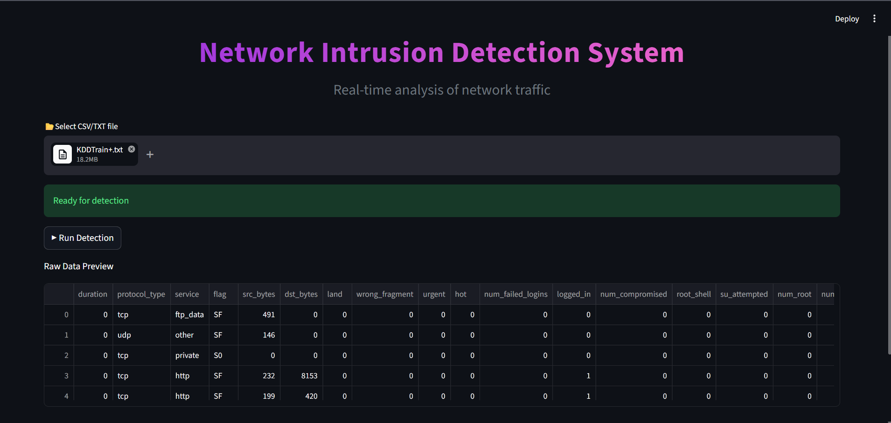
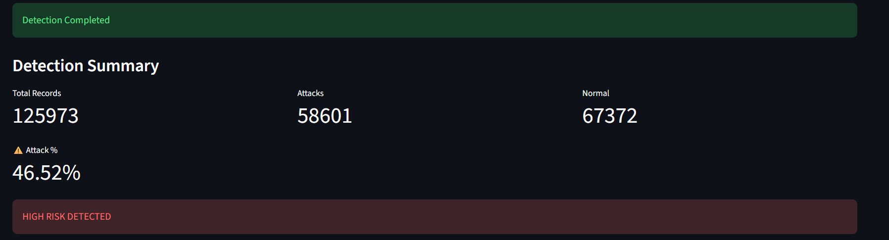
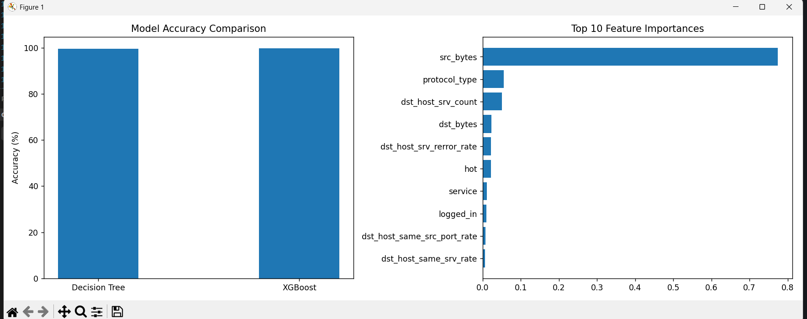
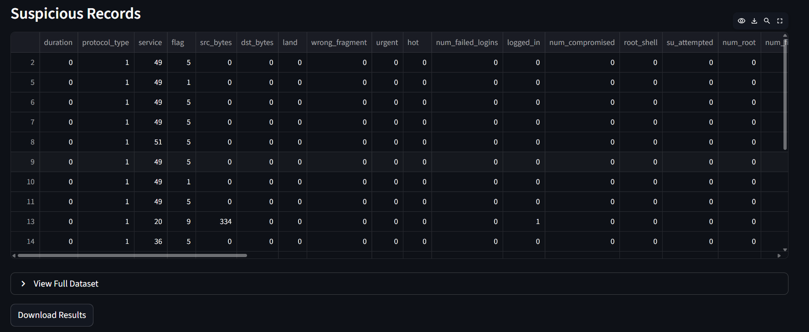

## 🚀 Live Demo

🌐 **Deployed Application:**  
👉 [Click here to run NIDS Project](https://nids-project.streamlit.app/)
---
# 🛡️ Network Intrusion Detection System (NIDS)

A Machine Learning-based Intrusion Detection System that classifies network traffic as **Normal or Attack** using the NSL-KDD dataset.  
Built with Python, XGBoost, and Streamlit for real-time detection and visualization.

---

## 🎯 Objective

Detect anomalous network behavior using supervised machine learning and demonstrate a real-world cybersecurity use case.

---

## ⚙️ Features

- 🔍 Classifies network traffic (Normal / Attack)
- ⚡ Real-time prediction using Streamlit
- 📊 Confidence score for predictions
- 📈 Interactive dashboard visualizations
- 📁 Supports CSV and TXT datasets
- 🧠 ML-based detection using XGBoost

---

## 🧠 Machine Learning Approach

- Dataset: NSL-KDD
- Problem Type: Binary Classification
  - Normal → 0
  - Attack → 1

### Models Used
- Decision Tree (baseline)
- XGBoost (final optimized model)

---

## 🧹 Data Preprocessing

- Label encoding for categorical features
- Handling missing/invalid values
- Feature selection based on importance
- No feature scaling required (tree-based models)

---

## 🔄 System Workflow

```
Dataset → Preprocessing → Feature Engineering → Model Training → model.pkl → Streamlit App → Prediction → Visualization
```

---

## 🏗️ Project Structure

```
Nids-project/
│
├── app.py              # Streamlit web application
├── nids.py             # ML training pipeline
├── KDDTrain+.txt       # NSL-KDD dataset
├── model.pkl           # Trained XGBoost model
├── README.md           # Documentation
```

---

## 🚀 How to Run

### 1. Clone Repository
```bash
git clone https://github.com/Padmakshi468/Nids-project.git
cd Nids-project
```

### 2. Install Dependencies
```bash
pip install -r requirements.txt
```

OR
```bash
pip install streamlit pandas numpy scikit-learn xgboost matplotlib joblib
```

### 3. Run Application
```bash
streamlit run app.py
```

---

## 📊 Output Visualizations

### 📌 Dashboard View:


### 📌 Detection Result:


### 📌 Plots:


### 📌 Suspicious Records:


---

---

## 🚀 Future Improvements

- Real-time packet capture integration
- Deep learning models (LSTM / CNN)
- REST API deployment
- Cloud deployment (AWS / Azure)
- Automated alert system

---

## 📜 License

This project is intended for academic and educational purposes.

---

